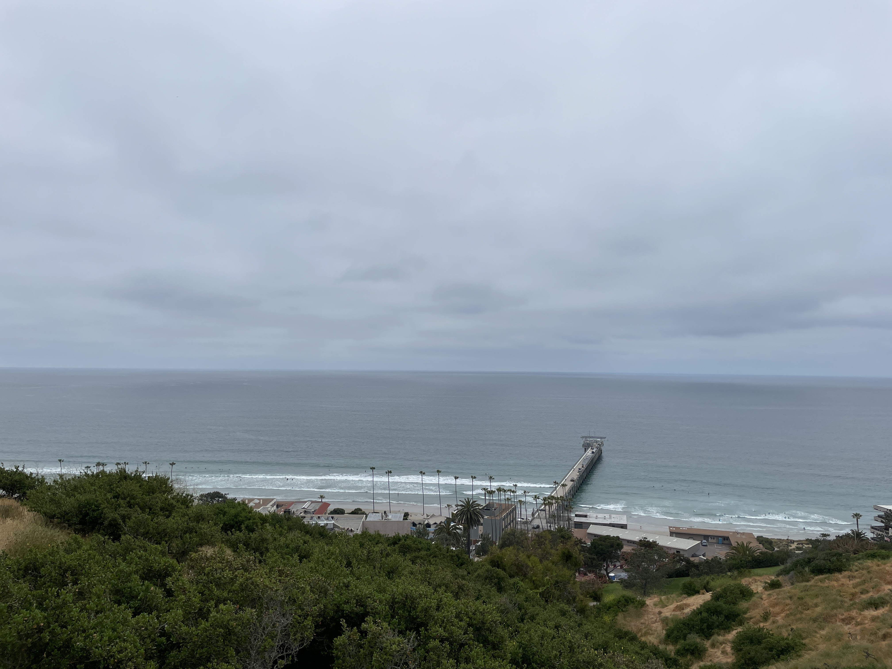
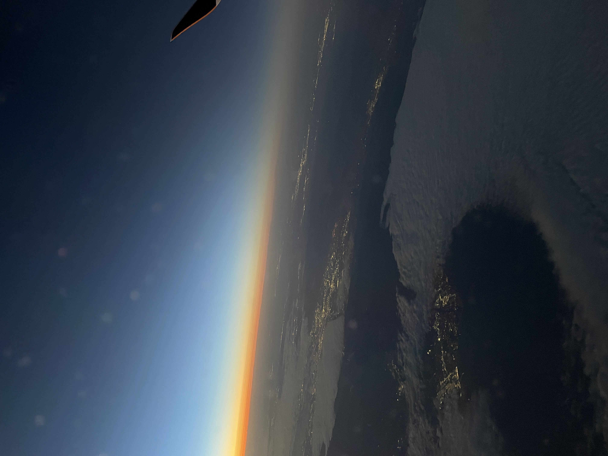

# User Page
## About Me

Hi, my name is **Vishaal Gaddipati** and I am a **third-year _Mathematics-Computer Science_ major** at _UCSD_. Some of my hobbies are tennis, watching movies, playing board games, and hiking.
I also enjoy spending some of my free time on traveling and photography. Here's a couple of pictures I've taken:




### About Programming
As a programmer, I am most familiar with ***Java and C++***. I've taken courses in Recommender Systems and Computer Graphics, both of which I enjoyed thoroughly. Having to create a Raytracer from scratch in C++ was definitely the most challenging thing I have done thus far. I look forward to gaining experience when it comes to programming as a team.

Most Used Languages Ranked:
1. Java
2. C++
3. Python

Topics I look forward to learning more about:
- HTML
* CSS
+ JavaScript

My goals for the quarter in CSE 110 are to:
- [ ] Understand the process of software engineering
- [ ] Create a project that follows proper SE practice
- [ ] Maintain an efficient and welcoming team environment

[Link to README](/README.md)

[Link to the top](#user-page)


### Extra Lab Markdown Formatting Practice
~~This was mistaken text~~

This is a <sub>subscript</sub> text

This is a <sup>superscript</sup> text

> Text that is a quote

Use `git status` to list all new or modified files that haven't yet been committed.

Some basic Git commands are:
```
git status
git add
git commit
```
This site was built using [GitHub Pages](https://pages.github.com/).